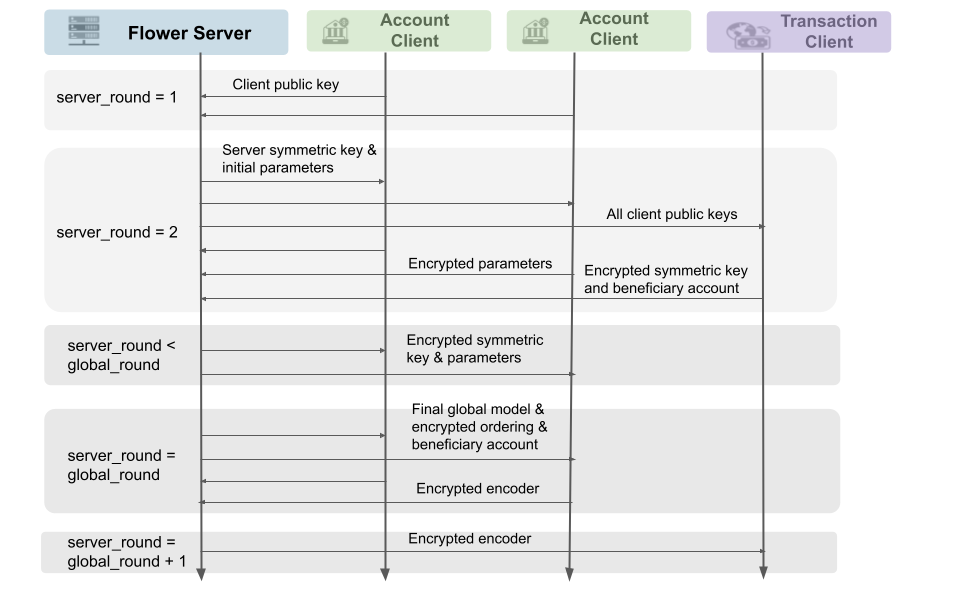
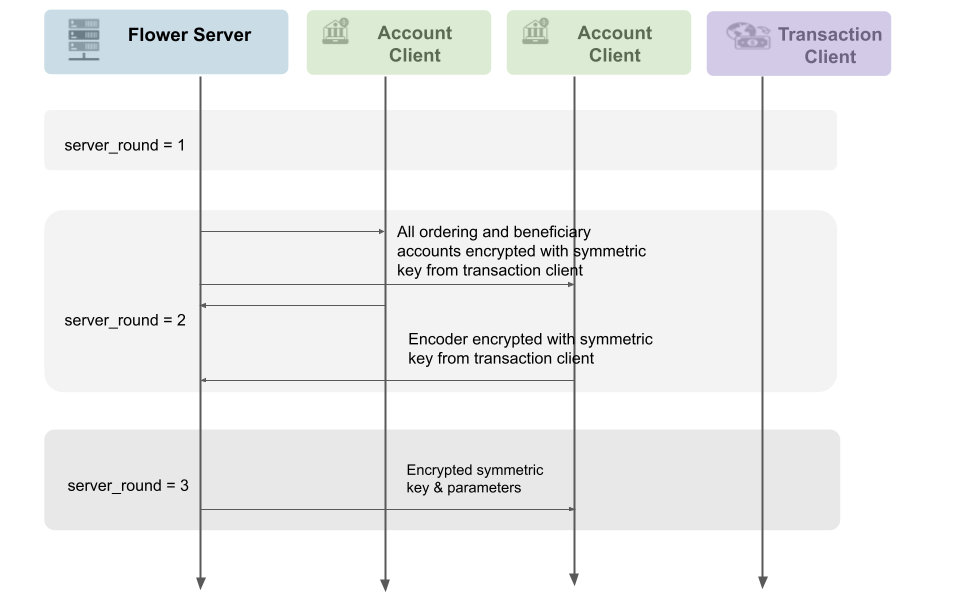

## HyFL - Privacy-Preserving Hybrid Federated Learning Framework for Financial Crime Detection

[](https://arxiv.org/abs/2302.03654) [](https://opensource.org/licenses/MIT)

## News

We have won the [third prize](https://drivendata.co/blog/federated-learning-pets-prize-winners-phases-2-3#illidan-lab) in phase 2 in the [PETs Prize Challenge](https://drivendata.co/blog/federated-learning-pets-prize-winners-phases-2-3)!

We are announced at Summit for Democracy, reported by [The White House](https://www.whitehouse.gov/ostp/news-updates/2023/03/31/us-uk-annouce-winners-innovation-pets-democratic-values/).

## Introduction

The recent decade witnessed a surge of increase in financial crimes across the public and private sectors, with an average cost of scams of \$102m to financial institutions in 2022. 

Developing a mechanism for battling financial crimes is an impending task that requires in-depth collaboration from multiple institutions, and yet such collaboration imposed significant technical challenges due to the privacy and security requirements of distributed financial data. 
For example, consider the Society for Worldwide Interbank Financial Telecommunications (SWIFT) system, which generates 42 million transactions per day across its 11,000 global institutions. Training a detection model of fraudulent transactions requires not only secured SWIFT transactions but also the private account activities of those involved in each transaction from corresponding bank systems. 

The distributed nature of both samples and features prevents  most existing learning systems from being directly adopted to handle the data mining task. 
In this research, we collectively address these challenges by proposing a **hybrid federated learning system (HyFL)** that offers secure and privacy-aware learning and inference for financial crime detection.  

We conduct extensive empirical studies to evaluate the proposed framework's detection performance and privacy-protection capability, evaluating its robustness against common malicious attacks of collaborative learning.
Find more details in our [paper](https://arxiv.org/abs/2302.03654).

## Communication Flow

The following two diagrams show the training and testing communication flows, respectively.


<div align="center"><em>Figure 1. Training Communication Flow</em></div>



<div align="center"><em>Figure 2. Testing Communication Flow</em></div>


## Prerequisites
The implementation of HyFL is based on the runtime of [PETs Prize Challenge](https://github.com/drivendataorg/pets-prize-challenge-runtime) and [Flower](https://flower.dev/). To run HyFL, you will need Docker installed on your system. Also you will need to download the datasets for training and testing.

### Download  datasets
The datasets are available on PETS competiton website. This repository contains a `data/` directory. When running commands to test the solution locally, contents of this directory will be mounted to the launched Docker container. This allows you to do local evaluation using the challenge's development data.

The `data/` directory has been prepopulated with some example directory scaffolding to copy the data into. It should look like this:

```text
data
├── fincrime/
    ├── centralized/
    │   ├── test/
    │   │   └── data.json
    │   └── train/
    │       └── data.json
    ├── scenario01/
    │   ├── test/
    │   │   ├── bank01/
    │   │   ├── partitions.json
    │   │   └── swift/
    │   └── train/
    │       ├── bank01/
    │       ├── partitions.json
    │       └── swift/
    └── scenarios.txt
```

Here is an explanation to help you understand this directory structure:

- **Federated**:
    - There is a `scenarios.txt` file. This is a newline-delimited file that lists partioning scenarios. The evaluation runner will loop through the scenarios present here. In the real evaluation runtime, there will be three scenarios defined. In the example provided here, there is one partitioning scenario named `scenario01` for each track.
    - Each scenario has a corresponding subdirectory (e.g., `data/fincrime/scenario01/`).
    - Inside the scenario directory, you will see `train/` and `test/` subdirectories. These will contain data for the respective stages.
    - Inside the `train/` or `test/` subdirectory, you will see a few things:
        - `partitions.json` is a JSON configuration file that lists each client in the scenario and paths to that client's data partition files. The top level key is the partition/client ID (`cid` in the simulation code). The inner JSON object lists the data filenames that will be provided to your client factory function. You will notice that the inner object's keys should match the argument names in the client factory signature. ([Docs](https://www.drivendata.org/competitions/105/nist-federated-learning-2-financial-crime-federated/page/587/#training))
        - Subdirectories for each data partition/client. The directory names should match the client IDs found in `partitions.json`. The simulation code will expect to find data files in each of these subdirectories matching the filenames in `partitions.json`. (You will need to copy your development data into here.)
        - In the `test/{cid}/` subdirectories, there will also be `predictions_format.csv` files. These will help you write your predictions in the correct format. Paths to these files will be provided to your test client factory function. You will need to populate these for local testing. 
- **Centralized**:
    - There is also a `centralized/` subdirectory (e.g., `data/fincrime/centralized/`). This will contain data for centralized evaluation.
    - Like with the federated scenarios, the centralized directory contains `train/` and `test/` subdirectories.
    - Inside the train or test subdirectory, you will see a `data.json`. This is a JSON configuration file that lists the data files that the training/test code will have access to. The keys should match the argument names of the data paths provided to your `fit` or `predict` functions ([Docs](https://www.drivendata.org/competitions/105/nist-federated-learning-2-financial-crime-federated/page/588/#training)).
    - The evaluation code will expect to find data files alongside `data.json` that match the filenames in `data.json`. (You will need to copy your development data into here.)
    - The evaluation code also expects to find a `test/predictions_format.csv`. This will help you write your predictions in the correct format. A path to this file will be provided to your `predict` function. You can download the full centralized version of the `predictions_format.csv` file for the development dataset on the data download page for your track.

In order to run evaluation locally, you will need to copy the development dataset into this directory structure. First, download the development datasets from the challenge data download page. Then, you will need to copy data files into either the client subdirectories for federated data matching the filenames in `partitions.json`, or into the `train/` or `test/` subdirectories matching the filenames in `data.json`. You will additionally need a `predictions_format.csv` file in the `test/` subdirectories.

For the federated data, it is up to you to partition the development data before copying it into the data directory.

### Build Docker image
Run the following command to build the Docker image with centralized and federated methods.
```bash
make build
```

### Create a package 
Run the following command to build the Docker image with _centralized_ and _federated_ methods. For a centralized package, set the environmental variable
```bash
export PACKAGE_TRACK=fincrime
export PACKAGE_TYPE=centralized
```
For a federated package, set the environmental variable
```bash
export PACKAGE_TRACK=fincrime
export PACKAGE_TYPE=federated
```
Then, pack the package source code using
```bash
make pack-package
```
This will create a package directory with both _centralized_ and _federated_ methods.
```
mkdir -p package/
cd package_src/fincrime; zip -r ../../package/package.zip ./*
adding: solution_centralized.py (deflated 74%)
adding: solution_federated.py (deflated 85%)
```

### Run package with training and testing
Run the following command to start training and testing
```bash
make test-package
```
To switch the method between _centralized_ and _federated_. Change the environment variable `PACKAGE_TYPE` accordingly.

### Cleaning up the package
After running the package and saving the results, run the following command to clean up the temporary files generated. This will clean up Python caches and delete the `package` directory.
```bash
make clean
```

## Credits

We acknowledge contributions to this implementation from the following two authors:
* Fan Dong, [DENOS Lab](https://denoslab.com/), University of Calgary, Canada
* Haobo Zhang, [Illidan Lab](https://illidanlab.github.io/), Michigan State University, USA
